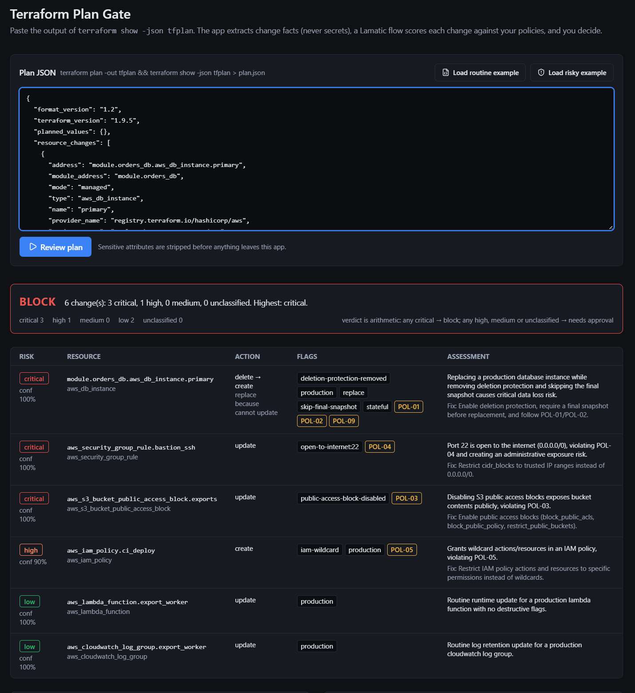

# Terraform Plan Gate

Paste a Terraform plan. Get back a verdict a reviewer can act on: **allow**, **needs approval**, or **block**, with the reason per resource, the policy it violates, the fix, and a review comment ready to post on the pull request. A person still makes the call; the gate makes sure they see what matters.



## The problem

`terraform plan` output for a real change is long, and the two lines that matter are easy to miss: the database that is going to be replaced instead of updated, the security group rule that now says `0.0.0.0/0`, the `skip_final_snapshot = true` someone added to make a test pass. Teams write these rules down in a wiki and then trust every reviewer to remember them on a Friday afternoon.

## What you get back

- **Every resource change scored** `low`, `medium`, `high` or `critical`, with a category (data loss, availability, security exposure, privilege, cost, drift, routine), the reasoning, and the concrete mitigation.
- **Policy references.** Ten infrastructure policies ship with the kit (no public buckets, no admin ports open to the internet, stateful resources need a snapshot before destroy, and so on). The review flow retrieves the ones relevant to this plan from a Vector Store and cites them by id. Your own rules go in with one command: edit `assets/policies.json` and run `npm run policies -- ../assets/policies.json`.
- **A verdict** computed from the counts, not asked of the model: any critical finding blocks; any high, medium or unassessed change needs approval; otherwise allow.
- **A review comment** in markdown, written the way a platform engineer writes one: verdict sentence, findings in order of severity, a before-apply checklist, and the routine changes listed in one line.
- **A decision record.** Approving a needs-approval plan or overriding a block requires a written justification; the app produces a JSON record with the verdict, the action, the reason and a timestamp to paste into the PR or a ticket.

## How it works

```text
terraform show -json tfplan
   │
   ├─ apps/lib/plan-parse.ts          deterministic, runs in the app
   │     └─ change facts              address, type, actions, action_reason,
   │                                  changed attribute names, safe-listed values, flags
   │
   └─ Lamatic flow tf-plan-review     judgment only
         ├─ Vector Search             policies relevant to this plan (store: tfpolicies)
         ├─ Generate JSON             risk + category + policy ids + mitigation per change
         ├─ Generate Text             the review comment
         └─ Code                      join, count, verdict
```

Two boundaries are deliberate:

- **Secrets never leave the app.** Anything Terraform marks in `before_sensitive` / `after_sensitive`, plus any attribute whose name looks like a secret, crosses the boundary as a *name* only. Values are sent for a short safelist of security-relevant attributes (`acl`, `publicly_accessible`, `cidr_blocks`, `deletion_protection`, `skip_final_snapshot`, `force_destroy`, encryption and KMS fields, ports and protocols, tags). The test suite checks that a redacted password never appears in the payload.
- **The model's output is checked before it counts.** The assemble node keeps one assessment per known resource address, drops any that name a resource not in the plan, accepts only the four risk levels and only policy ids that were actually retrieved, clamps confidence to 0–1, and counts anything unassessed as `unclassified`. The app validates the response shape again before rendering. The prompts wrap plan facts and policies in delimiters and state that text inside them is data, not instructions.
- **Facts are computed, judgment is generated.** Which resources are stateful, which ports are open to the world (AWS security groups, GCP firewalls and Azure network security rules are normalised to one check), whether an IAM policy is `"*"` on `"*"`, whether a replace removes deletion protection in the same change, whether the plan as a whole is too big to apply in one go: that is code, and it is tested. What the model adds is the ranking, the policy match, the explanation and the fix.

## Quickstart

1. In Lamatic Studio, recreate the two flows from `flows/` (they are Studio's own export). Re-select your model credentials on the Vectorize, Index, Vector Search, Generate JSON and Generate Text nodes: the `credentialId` values in `model-configs/` belong to the author's project.
2. Deploy `tf-policy-ingest` and run it once (Test in Studio with `{"run": "init", "policies": []}`, or `npm run policies` below). It embeds the ten default policies into the store.
3. Deploy `tf-plan-review` and copy its Flow ID (three-dot menu → Copy Flow Id).

```bash
cd kits/terraform-plan-gate/apps
cp .env.example .env.local     # fill in the values below
npm install
npm run dev
```

The app is Next.js 15 with React 18, Tailwind v4 on CSS variables, shadcn-style components, react-hook-form with zod for the two forms, and lucide icons.

Open http://localhost:3000 and press **Load risky example**. It is a plan that replaces a production Postgres instance with `skip_final_snapshot = true` and `deletion_protection = false`, opens SSH to the internet, disables a bucket's public access block, and creates a `*`/`*` IAM policy, mixed in with two routine updates. **Load routine example** is a plan with nothing above low.

### Environment

| Variable | Where to find it |
|---|---|
| `LAMATIC_API_KEY` | Studio → Settings → API Keys |
| `LAMATIC_PROJECT_ID` | Studio → Settings → General → Project ID |
| `LAMATIC_API_URL` | Studio → flow → Setup → API URL (`https://` only) |
| `LAMATIC_TERRAFORM_PLAN_REVIEW_FLOW_ID` | `tf-plan-review` → three-dot menu → Copy Flow Id |
| `LAMATIC_TERRAFORM_POLICY_INGEST_FLOW_ID` | `tf-policy-ingest` → Copy Flow Id. Only `npm run policies` needs it |

All of them are server-side only and the SDK is called from `actions/orchestrate.ts`, a server action.

### Your own policies

The policy set is data, not flow configuration. `assets/policies.json` holds the ten defaults in the shape the ingest flow accepts, `{ policy_id, title, text }`. Edit it, add to it, or replace it, then load it:

```bash
npm run policies -- ../assets/policies.json
```

The command validates the file, calls `tf-policy-ingest` with it as `policies: [string]`, and the flow embeds what it receives. Run it with no file to load the defaults built into the flow. The next review cites the new set, because the review flow searches the store at request time.

Loading appends. In our tests the Index node's `overwrite` setting did not replace earlier records with the same `policy_id`, and duplicates crowd distinct policies out of the search results. So to change the set: delete the `tfpolicies` store in Studio (Data → Context Stores → the store's delete action), then run the command once. The Index node recreates the store on the next load.

### Tests

```bash
npm test
```

Runs the parser against both sample plans (no-ops dropped, the risky plan raises the expected flags, GCP and Azure rules get the same treatment as AWS, blast radius is flagged, oversized plans are refused, no sensitive value or tag crosses the boundary), the response validator against a recorded flow response in `lib/fixtures/` plus malformed and self-contradicting variants of it, and the HTTPS-only endpoint check.

## Using it from CI

The app is the reviewer's view. `apps/cli/gate.ts` is the same gate for a pipeline:

```bash
terraform plan -out tfplan && terraform show -json tfplan > plan.json
cd kits/terraform-plan-gate/apps
npm run gate -- ../../../plan.json --comment
```

It prints one JSON line (`verdict`, `counts`, the non-low findings) followed by the review comment, and exits `0` for allow, `2` for needs-approval, `1` for block, `3` on a configuration error. The CLI reads the same `LAMATIC_*` variables from the environment or `apps/.env.local`.

`apps/ci/terraform-plan-gate.yml` is a ready GitHub Actions workflow: copy it into `.github/workflows/` of the repository that holds your Terraform, add the four `LAMATIC_*` secrets, and every pull request that touches `.tf` files gets the review comment posted on it and the job fails on `block`. `needs-approval` leaves the comment and passes the job, so the human still decides.

## Deploying

Use the deploy link in `lamatic.config.ts`, or point Vercel at this repository with the root directory set to `kits/terraform-plan-gate/apps` and the four variables above set in project settings.

## Layout

```text
kits/terraform-plan-gate/
├── lamatic.config.ts              project metadata
├── agent.md                       agent identity, flows, guardrails, failure modes
├── flows/tf-policy-ingest.ts      run once: policies -> embeddings -> Vector Store
├── flows/tf-plan-review.ts        the gate: search -> assess -> comment -> verdict
├── prompts/                       externalized prompts
├── model-configs/                 externalized model settings
├── scripts/                       the policy set and the assemble node
├── assets/policies.json           the default policies as editable data
├── constitutions/default.md       guardrails
└── apps/
    ├── actions/orchestrate.ts     the only place the SDK is called
    ├── lib/plan-parse.ts          plan -> change facts (deterministic)
    ├── lib/plan-parse.test.ts     parser tests
    ├── lib/validate.ts            response contract check
    ├── lib/validate.test.ts       contract tests against a recorded response
    ├── lib/endpoint.ts            HTTPS-only check for the Lamatic endpoint
    ├── cli/gate.ts                the CI entry point
    ├── cli/policies.ts            load your policy set into the store
    ├── ci/terraform-plan-gate.yml GitHub Actions workflow to copy
    ├── components/                input, verdict banner, change table, comment, decision
    ├── components/ui/             shadcn-style Button, Textarea, Label
    └── public/samples/            the two example plans
```

## Limitations

- Reads `terraform show -json` (format 1.x). Plain `terraform plan` text is not parsed.
- Deterministic flags cover the AWS, Google and Azure resource types and rule shapes listed in `plan-parse.ts`. Other providers still get scored by the model from actions and attribute names, without the flags.
- Policies are matched by similarity to the plan summary and the top ten hits (deduplicated by policy id) are sent. A policy that does not resemble anything in the plan is not consulted, which is the intended behaviour and also the reason the model is told to cite only ids it was given.
- One review covers up to 200 resource changes; larger plans are refused with advice to split them (`-target`). Above 12 findings the comment switches to one compact line per extra finding so every address still appears.
- The gate scores changes; it does not estimate cost or simulate the apply.
